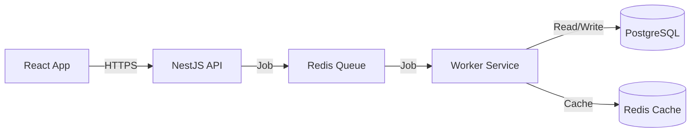

# System Architecture

## Component Overview

The system follows a microservices-inspired architecture to separate concerns and ensure scalability.

### 1. Frontend Client
*   **Technology**: React (Vite), Tailwind CSS
*   **Role**: User interface for submission and result visualization.
*   **Hosting**: Static hosting (Vercel/Netlify/S3).
*   **Communication**: REST API calls to the Backend.

### 2. API Gateway & Backend
*   **Technology**: NestJS (Node.js)
*   **Role**: 
    *   Authenticates users (JWT).
    *   Validates input.
    *   Manages rate limits (Throttler).
    *   Orchestrates scan jobs.
    *   Provides admin endpoints.

### 3. Asynchronous Task Queue
*   **Technology**: Redis (BullMQ)
*   **Role**: Decouples the ingestion of a scan request from the heavy processing.
*   **Why**: Prevents HTTP timeouts when external APIs are slow.

### 4. Analysis Workers
*   **Technology**: Node.js (part of NestJS monorepo, distinct process)
*   **Role**:
    *   Consumers of the Redis Queue.
    *   Execute the `ScanJob`.
    *   Perform blocking I/O (API calls) and CPU-intensive tasks (Regex).

### 5. Data Persistence
*   **Primary Database**: PostgreSQL
    *   Stores `Users`, `Scans`, `Results`, `Blacklist`.
    *   Why: Relational integrity, ACID compliance, complex querying.
*   **Cache**: Redis
    *   Stores API responses (e.g., "google_safe_browsing:example.com").
    *   Why: Reduce API costs and latency.

## Infrastructure Diagram

