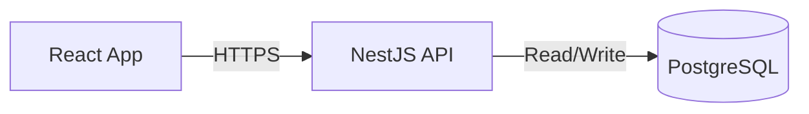

# System Architecture

## Component Overview

The system follows a microservices-inspired architecture to separate concerns and ensure scalability.

### 1. Frontend Client
*   **Technology**: React (Vite), Tailwind CSS
*   **Role**: User interface for submission and result visualization.
*   **Hosting**: Static hosting (Vercel/Netlify/S3).
*   **Communication**: REST API calls to the Backend.

### 2. API Gateway & Backend
*   **Technology**: NestJS (Node.js)
*   **Role**: 
    *   Authenticates users (JWT).
    *   Validates input.
    *   Manages rate limits (Throttler).
    *   Orchestrates scan jobs.
    *   Provides admin endpoints.

### 3. Data Persistence
*   **Primary Database**: PostgreSQL
    *   Stores `Users`, `Scans`, `Results`, `Blacklist`.
    *   Why: Relational integrity, ACID compliance, complex querying.

## Infrastructure Diagram

## Deployment Strategy

### 1. Backend (Render)
*   **Runtime**: Node.js v22.
*   **Platform**: Render Web Service.
*   **Environment Variables**:
    *   `DATABASE_URL`: Connection string from **Neon Console**.
    *   `JWT_SECRET`: Secure random string.
    *   `SAFE_BROWSING_API_KEY`: Google API key.

### 2. Database (Neon)
*   **Provider**: Neon (Serverless PostgreSQL).
*   **Authentication**: Connection string provided to Render Backend.
*   **Migration**: Validated via `npx prisma migrate deploy` in the Render build command.

### 2. Frontend (Static SPA)
*   **Build Output**: Static files (`dist/` folder containing HTML/CSS/JS).
*   **Platform**: Vercel, Netlify, or AWS S3 + CloudFront.
*   **Configuration**:
    *   Must handle SPA routing (redirect 404s to `index.html`).
    *   `VITE_API_URL` environment variable pointing to the Backend URL.

### 3. Database Migration
*   **Current State**: SQLite (`dev.db`) for local development.
*   **Production**: Change Prisma provider to `postgresql`.
    *   Update `schema.prisma`: `provider = "postgresql"`.
    *   Run `npx prisma migrate deploy` during build/startup.
