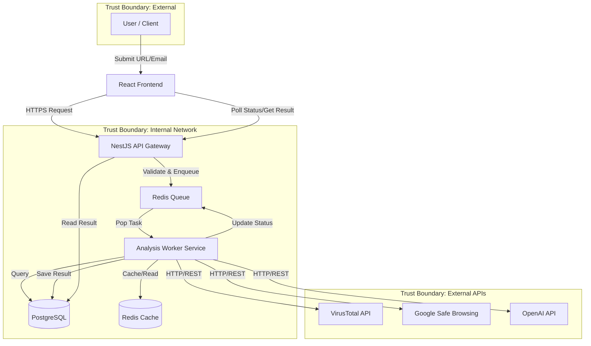

# Data Flow Diagram

This document outlines the movement of data through the system, highlighting trust boundaries and asynchronous processing.

## High-Level Flow

## Detailed Data Path

1.  **Submission**:
    *   User inputs data into the Frontend.
    *   Frontend performs basic validation (format check).
    *   Data is sent to `POST /api/scan` at the API Gateway.

2.  **Ingestion & Queuing**:
    *   API Gateway validates authentication (if logged in) and rate limits.
    *   Gateway checks Redis Cache for a recent existing scan of the same URL (Hit? Return immediately).
    *   If no cache, Gateway pushes a `ScanJob` to the Redis Queue and returns a `job_id` to the user.

3.  **Processing (The Worker)**:
    *   Worker service pulls `ScanJob`.
    *   **Step 1: Local Heuristics**: Regex checks, allow/blocklist lookup in DB.
    *   **Step 2: External APIs**: Parallel calls to VirusTotal, Safebrowsing, etc.
    *   **Step 3: AI Analysis** (Conditional): If heuristics are inconclusive, call LLM.
    *   **Step 4: Scoring**: Aggregator function calculates final 0-100 score.

4.  **Completion**:
    *   Result is written to `scans` table in PostgreSQL.
    *   Result is cached in Redis (TTL: 24 hours).
    *   Job status updated to `COMPLETED`.

5.  **Retrieval**:
    *   Frontend polls `GET /api/scan/{job_id}`.
    *   Gateway returns the JSON result.
