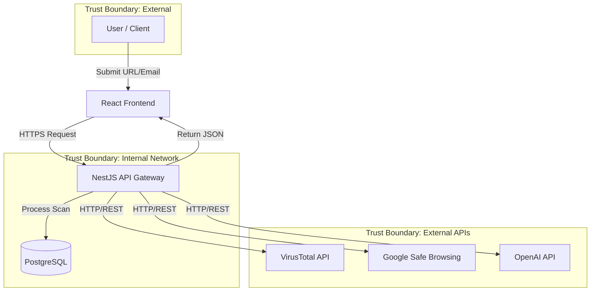

# Data Flow Diagram

This document outlines the movement of data through the system, highlighting trust boundaries.

## High-Level Flow

## Detailed Data Path

1.  **Submission**:
    *   User inputs data into the Frontend.
    *   Frontend performs basic validation (format check).
    *   Data is sent to `POST /api/v1/scan` at the API Gateway.

2.  **Processing (The Scanner)**:
    *   API Gateway validates authentication (if logged in) and rate limits.
    *   **Step 1: Local Heuristics**: Regex checks, allow/blocklist lookup in DB.
    *   **Step 2: External APIs**: Parallel calls to VirusTotal and Safebrowsing.
    *   **Step 3: AI Analysis** (Conditional): If enabled, call LLM for context analysis.
    *   **Step 4: Scoring**: Aggregator function calculates final 0-100 score with weights.

3.  **Completion**:
    *   Result is written to `scans` table in PostgreSQL.
    *   JSON result is immediately returned to the Frontend in the HTTP response.

4.  **Retrieval (History)**:
    *   Frontend can poll `GET /api/v1/scan` for paginated history of past scans.
