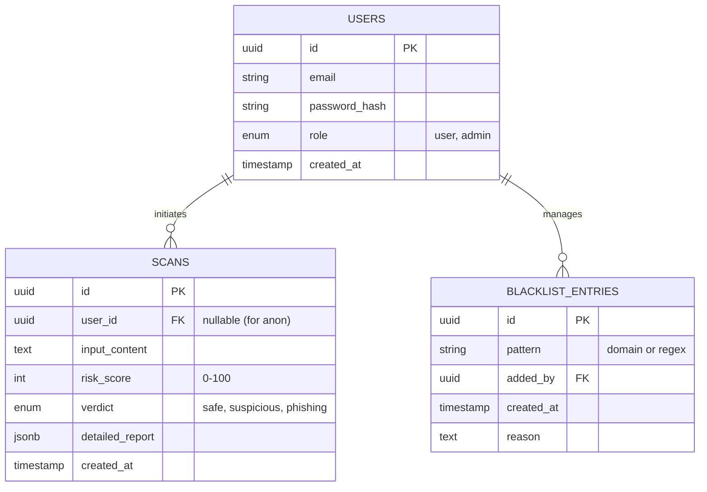

# Database Schema

## ER Diagram (Mermaid)

## Table Design Decisions

### 1. `users`
*   Standard user management.
*   `role` column separates regular users from admins (RBAC).

### 2. `scans`
*   The central ledger of the application.
*   `input_content`: Stores the URL or email snippet.
*   `detailed_report` (JSONB): Storing the full breakdown (VT results, AI explanation) as JSON allows flexibility. We don't need to query *inside* the report often, just retrieve it.
*   `user_id`: Nullable to allow anonymous scans (if we choose to support that), or for public-facing demo mode.

### 3. `blacklist_entries`
*   Allows manual override of the automated system.
*   If a domain is in this table, score is automatically 100.
